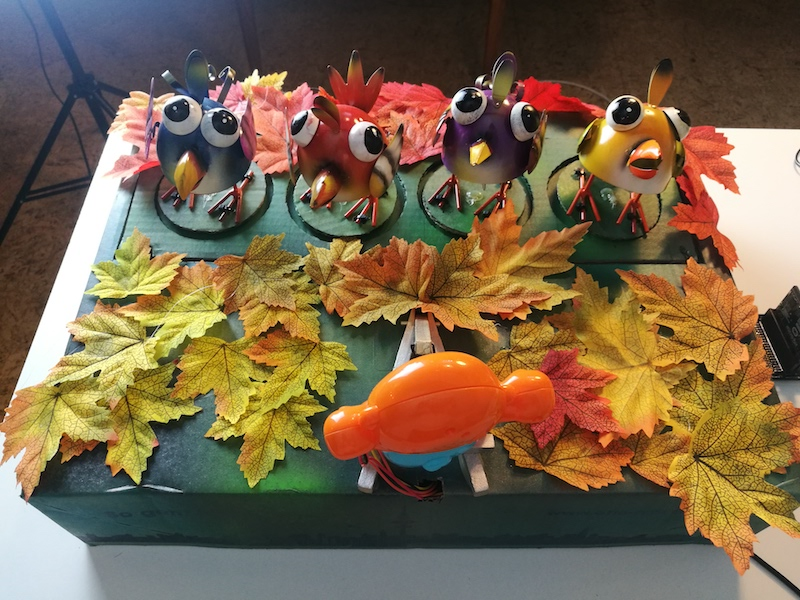

# DancingBirds
Software for the DancingBirds project
This repository contains the Arduino Mega 2560 and the javascript sources for the BBC micro:bit in the Microbit folder.

Details on the project shown on [**Project14 Dancing Bird**](https://www.element14.com/community/community/project14/clusteredmcus/blog/2018/10/13/the-dancing-birds).

